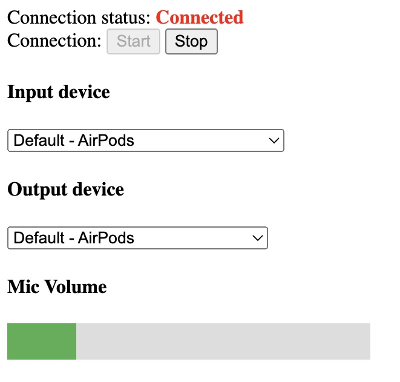

# Audio Streaming Web App

This is a simple web application that sends the user's microphone input to the server and streams it back in a simple echo form. Please refer to this repository as a base app for real-time voice communication applications.




## Let's get started!

Use python 3.8 or newer one.

```shell
pip install fastapi
```

Prepare dummy ssl certificates.

```shell
openssl genrsa 2048 > host.key
chmod 400 host.key
openssl req -new -x509 -nodes -sha256 -days 365 -key host.key -out host.cert
```

Run!

```shell
uvicorn main:app --reload --host 127.0.1 --port 8501 --ssl-keyfile=host.key --ssl-certfile=host.cert
```

If you find this repository useful in your research, please consider citing my work:

```
@misc{Ohmura2024,
  author = {Junki Ohmura.},
  title = {Audio Streaming Web App},
  year = {2024},
  publisher = {GitHub},
  journal = {GitHub repository},
  howpublished = {\url{https://github.com/jojonki/audio-streaming-web-app/}},
}
```

## References

- [WebAudio+WebSocket でブラウザへの音声リアルタイムストリーミングを実装する](https://gist.github.com/ykst/6e80e3566bd6b9d63d19?permalink_comment_id=1877566)
